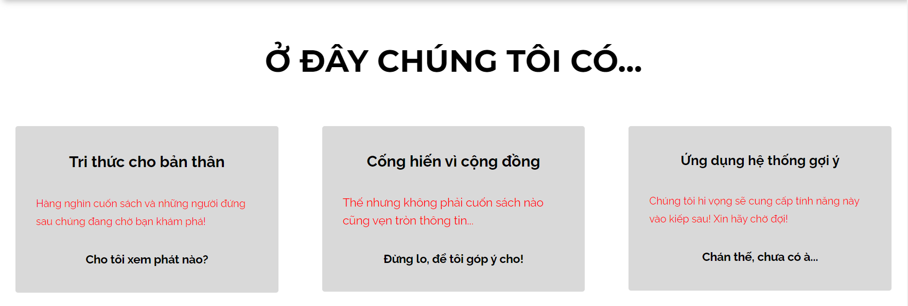
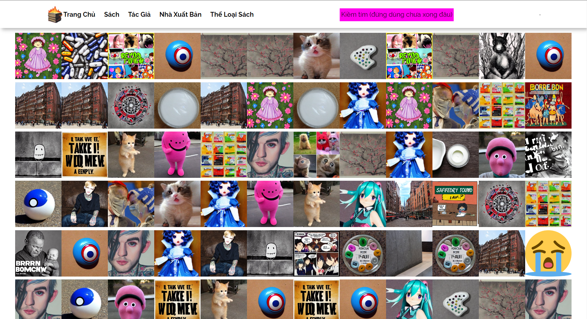

# bookwarm

Bookwarm Project - Database Course Project

**Preview**

![Chen Model] (_docs/ChenModel.PNG)

**Features:**

* Frontpage
  * [x] Completed (will be refactored if needed).
* General
  * [x] Return a "not available" site if a book, author, publisher or genre is not found.
  * [x] Routing from books to other pages and the otherway around (from a book to the previous/next book, to its authors, to its publisher, to its genres - or from an author, to their books...).
  * [ ] Create a newsfeed.
  * [ ] Apply a recommender system to the newsfeed.
  * [ ] Search for books, authors, publishers and genres.
* Books
  * [x] Preview all books in the index page of books.
  * [x] Preview all "todo" books in the todo of books (books that lack details in authors/genres/publication date/pages).
  * [x] View any book in detail: title, cover, authors, genres, publication date, number of pages, average rating.
  * [x] View book reviews (rating and comments).
  * [ ] Write book reviews (rating and comments).
* Authors
  * [x] Preview all authors in the index page of authors.
  * [x] View any author in detail: their name and their books.
* Publishers
  * [x] Preview all publishers in the index page of publishers.
  * [x] View any publisher in detail: their name and their books.
* Genres
  * [x] Preview all genres/categories in the index page of genres.
  * [x] View any genre in detail: their name and their books.
* Admin
  * [ ] Add/Remove/Edit information of books, authors, publishers, genres.
  * [ ] Add/Remove/Edit information of users.
* Users
  * [ ] Register for their accounts.
  * [ ] Login to their accounts.
  * [ ] Edit their accounts.
  * [ ] Remove their accounts.
  
**Credits:**

* The frontend was initially built with TeleportHQ: <http://www.teleportHQ.io>
* Logo and Book Covers: <https://StableDiffusionWeb.com>
* The crying emoji 😭: <https://twemoji.twitter.com/>
* Diagramming tool: <https://visual-paradigm.com>

* Other Pictures/Photos:
  * Burning Books - <https://www.flickr.com/photos/44282411@N04/4141069138/> (found on wikipedia)
  * Gigachad - <https://genius.com/Bring-me-the-horizon-can-you-feel-my-heart-lyrics>

* Sounds
  * Ching Cheng Hanji - Peng Lexer Remix - <https://open.spotify.com/album/15BlFCcAqQaZNdygkDYOwe>

* Git-undo (for the nextjs_build branch)
  * git reset --soft HEAD^
  * then
  * git push origin +nextjs_build --force
  * <https://stackoverflow.com/questions/448919/how-can-i-remove-a-commit-on-github>
